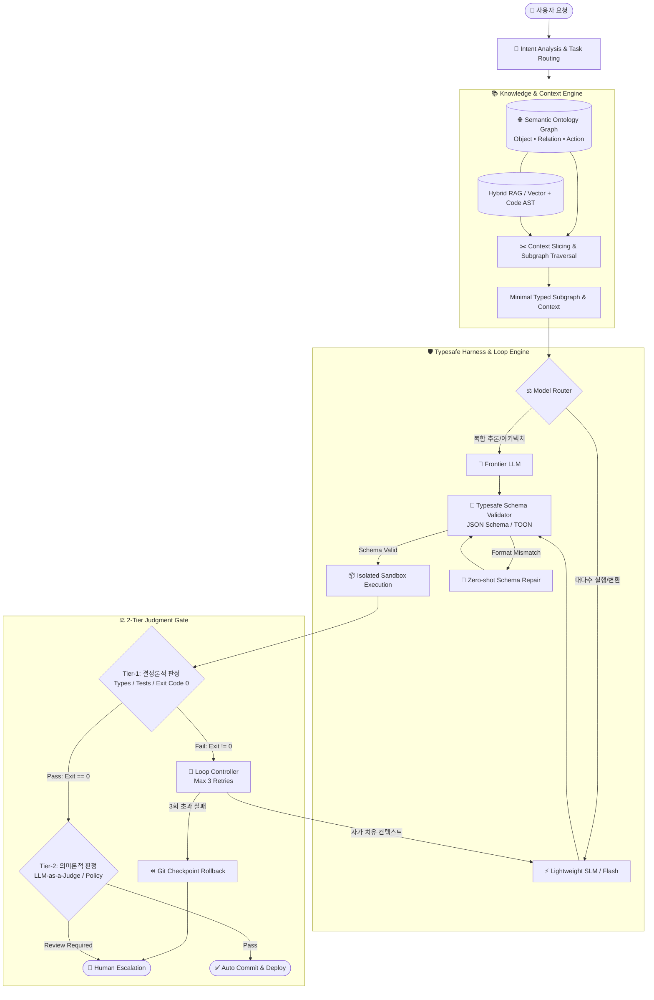
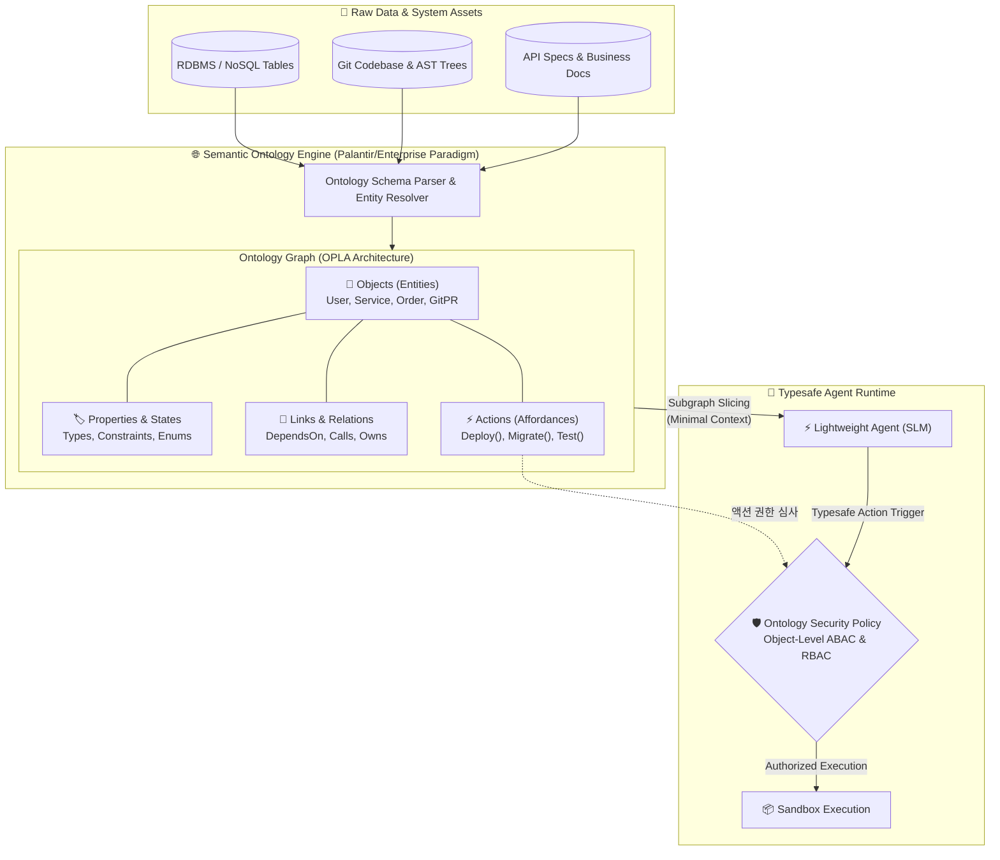
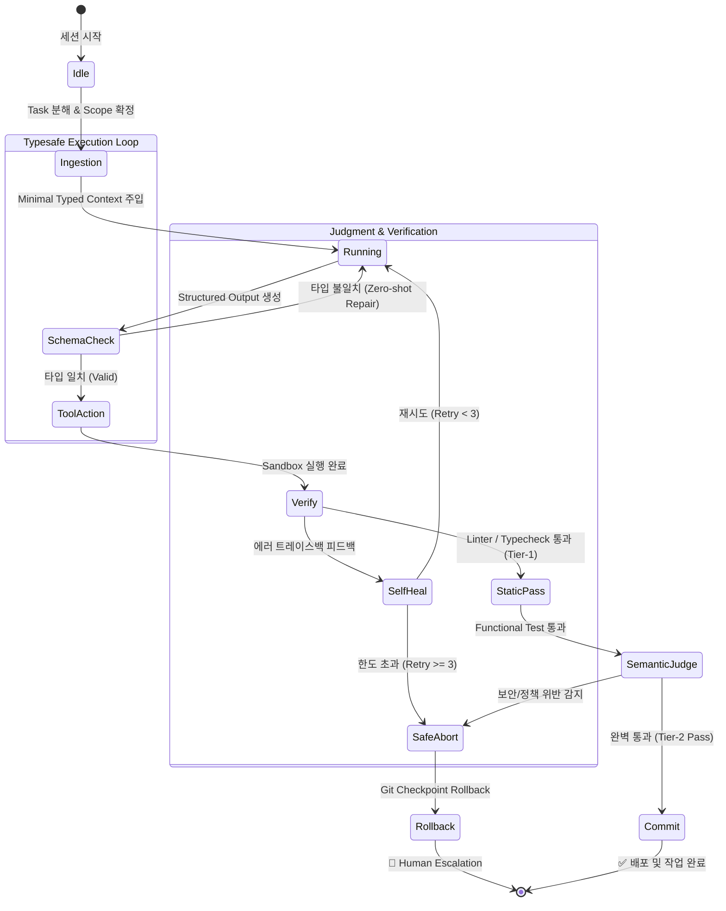

# 🛡️ AI Agent Governance & Harness Architecture (AAG v3.0)

> **"Autonomous Execution, Typesafe Contract, Semantic Ontology, Loop Engineering, Lightweight Model Optimization"**  
> 본 규정은 프로젝트 내 모든 AI 에이전트, 시맨틱 온톨로지(Ontology), 오케스트레이션 하네스(Harness), 런타임 제어 루프의 개발·운영 표준을 정의합니다.
>
> 📅 **Last Updated:** 2026-09-30 (v3.0 Typesafe & Semantic Ontology Edition)

---

### 💡 v3.0 핵심 아키텍처 패러다임 전환

기존 AI 에이전트 시스템이 초거대 언어 모델(Frontier LLM)의 자체 추론력과 비정형 자연어 프롬프트에 과도하게 의존했다면, **AAG v3.0**은 다음 **6대 엔지니어링 원칙**을 기반으로 안정적이고 경제적인 엔터프라이즈 자동화를 구현합니다:

1. **하네스 엔지니어링 (Harness Engineering):** *"Model is a commodity, Harness is the moat."* 모델 자체보다 에이전트를 둘러싼 실행 환경(샌드박스, 컨텍스트 슬라이싱, 상태 체크포인트, 결정론적 롤백)을 우선적으로 엔지니어링합니다.
2. **시맨틱 온톨로지 (Semantic Ontology & Actionable Graph):** 비정형 텍스트 청크나 파편화된 RAG를 넘어, 시스템의 객체(Object), 속성(Property), 관계(Link), 실행 가능한 행위(Action/Affordance)를 지식 그래프 온톨로지로 통합하여 에이전트의 지식 접지(Grounding)와 권한 통제를 완성합니다.
3. **루프 엔지니어링 (Loop Engineering):** 단순 `while true`의 무한 루프나 원시적 ReAct 패턴을 탈피하고, 유한 상태 머신(FSM) 기반의 수렴 보장, 조기 종료(Halting Guarantee), 서킷 브레이커를 강제합니다.
4. **Typesafe AI (타입 세이프 AI & 계약 우선주의):** 비정형 자연어 지시를 배제하고, 입력·도구 호출·최종 출력을 Pydantic, Zod, JSON Schema, TOON 등 엄격한 타입 계약으로 감싸 런타임 환각(Hallucination)을 원천 차단합니다.
5. **경량 모델(SLM / Flash) 최적화:** 엄격한 타입 제약, 온톨로지 서브그래프 슬라이싱, 최소 컨텍스트 주입을 결합하여, 경량 모델(SLM, Flash/Mini)로도 고비용 Frontier 모델 이상의 신뢰성과 처리 속도, 90% 이상의 비용 절감을 달성합니다.
6. **2단계 판정 이론 (Two-Tier Judgment Theory):** 비용 $0의 기계적·결정론적 판정(컴파일러, 린터, 테스트러너)을 1차 관문으로 두고, 검증된 결과에만 의미론적 평가(LLM-as-a-Judge)를 선별 적용하여 판정 신뢰도를 극대화합니다.

---

## 1. ⚖️ The Tram Constitution (AI 헌법 & 핵심 철학)

1. **Helpful & Harmless:** 윤리적·법적 선을 엄격히 준수한다. (Rate Limit 준수, 개인정보 및 보안 데이터 보호)
2. **Objectivity & Critical Thinking:** 사용자의 지시를 맹목적으로 따르지 않고, 기술적 결함이나 위험 요소를 사전에 객관적으로 조언한다.
3. **Honesty & Anti-Hallucination:** 모르는 것은 모른다고 명시하며, 검증되지 않은 가짜 정보를 철저히 배제한다.
4. **Builders > Solvers:** 단순 코드 생성 퍼즐을 넘어, 실제 기동하고 검증된 "동작하는 제품(Ship It)"을 산출한다.
5. **Contract-First & Typesafe Execution:** 자연어 설명보다 입출력 스키마(Typesafe Interface)와 기계적 검증(Test/Linter)을 최우선 기준으로 삼는다.
6. **Ontology-Grounded Action:** 추측에 의한 비즈니스 로직 조작을 금지하며, 정의된 온톨로지 스키마와 관계 제약(Invariants) 내에서만 데이터를 탐색하고 조작한다.
7. **Harness-Centric & Model-Agnostic:** 특정 거대 모델에 종속되지 않으며, 강건한 하네스, 온톨로지, 타입 시스템을 통해 경량 모델 환경에서도 일관된 품질을 보장한다.

---

## 2. 🗺️ End-to-End Agentic Product Architecture

사용자의 단일 자연어 요청이 수신되어 온톨로지 지식망 분석, RAG 검색, 모델 라우팅, 타입 세이프 하네스 실행, 2단계 판정을 거쳐 안전하게 커밋되기까지의 전체 아키텍처 흐름입니다.



---

## 3. 🧬 Typesafe AI & Schema-First Protocol

자연어 프롬프트는 확률적(Probabilistic)이며 모호합니다. 프로덕션 레벨의 에이전트는 입출력 경계가 반드시 **결정론적 타입(Deterministic Type)**으로 고정되어야 합니다.

```text
[자연어 입력] ──► [타입 스키마 강제 (Pydantic/Zod/TOON)] ──► [결정론적 도구 호출] ──► [컴파일 타임 검증]
```

### 1️⃣ Contract-First 원칙
* 모든 에이전트 간 통신, 도구(Tool) 호출 파라미터, 산출물 반환값은 사전에 정의된 **엄격한 스키마(Schema)**를 따릅니다.
* 에이전트에게 전달되는 지침은 모호한 장문 텍스트보다 **TypeScript 인터페이스 / Python Pydantic 모델 / JSON Schema** 형태로 제공될 때 환각률이 90% 이상 감소합니다.

### 2️⃣ Structured Output & Tool Calling 강제
* 모델이 자유로운 서술형 텍스트를 출력하는 것을 금지하며, 시스템 레벨에서 `json_schema` 또는 `TOON` 구조화 출력을 강제합니다.
* 파서(Parser)가 모델 출력을 파싱하지 못하거나 필드 타입이 불일치할 경우, LLM에게 전체 컨텍스트를 다시 묻지 않고 **타입 검증 에러(Type Validation Error) 스니펫만 주입하여 1턴 내에 즉각 복구(Zero-shot Schema Repair)**합니다.

### 3️⃣ 컴파일러/타입체커 기반 Self-Healing
* 코드 생성 시 "사람이 읽고 검토"하는 방식 대신, 언어별 정적 타입 분석기(`tsc`, `mypy`, `pyright`, `cargo check`)의 결과를 루프에 피드백으로 주입합니다.
* **원칙:** *"If it compiles and passes schema, it operates."*

---

## 4. 🌐 Semantic Ontology & Actionable Graph Architecture

전통적인 검색 증강 생성(Naive RAG)은 텍스트를 단순히 청크(Chunk)로 쪼개어 유사도 순으로 던져줍니다. 하지만 복잡한 시스템에서 에이전트가 "진짜 작업"을 수행하려면, **엔티티 간의 관계, 불변식(Invariants), 실행 가능한 행위(Affordance)**를 완벽히 이해해야 합니다. Tram AAG는 **시맨틱 온톨로지(Semantic Ontology)**를 에이전트 지식 및 행동의 기준틀(Ground Truth)로 삼습니다.



### 1️⃣ OPLA: 온톨로지 4대 핵심 구성 요소
온톨로지는 엔터프라이즈 환경을 다음 4가지 핵심 요소로 정형화합니다:

| 요소 | 정의 및 역할 | 예시 |
| :--- | :--- | :--- |
| **Objects (객체/엔티티)** | 시스템 내에서 실재하는 고유 식별 비즈니스/기술 단위 | `DatabaseTable`, `MicroService`, `BillingAccount`, `PullRequest` |
| **Properties (속성/상태)** | 객체가 가지는 정적 메타데이터, 동적 런타임 상태 및 타입 제약 | `status: "ACTIVE"`, `schema_version: 3`, `max_concurrency: 50` |
| **Links (의미론적 연결)** | 객체 간의 종속성, 상속, 인과 관계를 나타내는 유향 엣지 | `ServiceA --(Calls)--> ServiceB`, `TableX --(BelongsTo)--> DomainY` |
| **Actions (실행 권능/Affordances)** | 특정 객체에 대해 에이전트가 호출할 수 있는 타입화된 도구(Tool) | `User.refund()`, `Service.restart()`, `Schema.migrate()` |

### 2️⃣ 온톨로지 기반 지식 접지 (Ontology Grounding) vs Naive RAG
* **관계적 일관성 보장:** Naive RAG는 텍스트 유사도만 보므로 A서비스와 B서비스의 의존 순서를 뒤바꿀 수 있습니다. 온톨로지는 그래프 탐색(Graph Traversal)을 통해 `DependsOn` 방향성을 100% 보장합니다.
* **불변식(Business Invariants) 강제:** "결제 취소는 주문 상태가 PENDING_PAYMENT 또는 COMPLETED일 때만 가능하다"와 같은 비즈니스 규칙이 온톨로지 링크/제약조건으로 사전 선언되어 있어 에이전트의 불법 상태 전이를 차단합니다.

### 3️⃣ 온톨로지 서브그래프 슬라이싱 & 경량 모델(SLM) 연계
* 에이전트에게 전체 온톨로지를 주지 않습니다. 에이전트가 처리할 작업과 직접 연관된 **1~2홉(Hop) 반경의 서브그래프(Subgraph)**만 추출하여 전달합니다.
* 이 경량화된 그래프 스냅샷은 4KB 미만의 토큰만 차지하면서도 완벽한 문맥을 제공하므로, **경량 모델(SLM/Flash)이 복잡한 엔터프라이즈 추론에서도 환각 없이 작업을 완수**할 수 있습니다.

### 4️⃣ 온톨로지 기반 객체 수준 보안 및 권한 통제 (Object-Level RBAC/ABAC)
* 단순 API 키나 파일 권한을 넘어, **"어떤 에이전트가 어떤 온톨로지 객체(Object)에 대해 어떤 액션(Action)을 트리거할 수 있는가"**를 온톨로지 레이어에서 중앙 통제합니다.
* 예: `Dev Agent`는 `Service.restart()` 액션 권한이 있지만, `BillingAccount.charge()` 액션 권한은 온톨로지 보안 정책에 의해 원천 차단됩니다.

---

## 5. ⚙️ Harness & Loop Engineering

에이전트의 성공을 좌우하는 것은 모델의 크기가 아니라, 모델을 감싸고 있는 **실행 하네스(Harness)**와 **제어 루프(Loop)**의 정밀함입니다.

### 1️⃣ 하네스 엔지니어링 (Harness Engineering)
* **Context Slicing (컨텍스트 슬라이싱):** 전체 저장소를 통째로 모델에 주입하지 않습니다. 하네스는 온톨로지 서브그래프와 AST(구문 트리) 분석을 바탕으로 수정 대상 파일과 직접 관련된 인터페이스만 칼로 베어내듯 슬라이싱하여 주입합니다.
* **Sandbox Isolation (격리 샌드박스):** 에이전트의 모든 파일 변경 및 명령어 실행은 격리된 작업 디렉터리 및 Git 임시 브랜치에서 실행됩니다.
* **Deterministic Rollback (결정론적 롤백):** 작업 전 `git checkpoint`를 자동 생성하며, 검증 실패 시 `git reset --hard` 및 클린업을 통해 시스템을 오염 없이 즉시 원상 복구합니다.

### 2️⃣ 루프 엔지니어링 (Loop Engineering)
* **FSM (유한 상태 머신) 기반 제어:** 에이전트의 실행은 단순 `while` 루프가 아닌 명확한 상태(State) 전이 머신으로 통제됩니다.
* **Halting Guarantee (종료 보장):** 
  - 서브태스크당 **최대 5턴** 엄격 제한.
  - 동일한 에러 메시지가 2회 연속 발생할 경우(Cycle Detection) 즉시 루프를 탈출하고 계획 재수립 단계로 전이.
* **Circuit Breaker (서킷 브레이커):** 누적 토큰 소비량 또는 연속 실패 횟수가 임계치를 초과하면 하네스가 강제로 세션을 일시 중단하고 인간에게 통제권을 넘깁니다.



---

## 6. ⚡ Lightweight Model (SLM/Flash) Optimization

대규모 엔터프라이즈 환경에서 모든 태스크에 초거대 모델(Frontier LLM)을 사용하는 것은 비용과 지연시간 측면에서 비효율적입니다. **AAG v3.0은 경량 모델(SLM, Flash/Mini)을 1급 시민으로 최적화**합니다.

| 비교 항목 | 기존: Frontier LLM 중심 접근 | AAG v3.0: 온톨로지 하네스 + 경량 모델 |
| :--- | :--- | :--- |
| **주요 사용 모델** | GPT-4o, Claude 3.5 Sonnet, Gemini Pro | **Gemini Flash, Claude Haiku, Llama-3-8B / 로컬 SLM** |
| **비용 (Cost)** | 고비용 ($3.00 ~ $15.00 / 1M 토큰) | **초저비용 ($0.075 ~ $0.50 / 1M 토큰, 90% 이상 절감)** |
| **응답 지연시간 (Latency)** | 5초 ~ 20초 (복합 추론 시 지연 심화) | **0.5초 ~ 2초 (실시간 인터랙티브 실행 가능)** |
| **환각 방지 기제** | 모델의 "자체 주의력(Self-Attention)"에 의존 | **온톨로지 그래프 제약 + 스키마 하네스로 원천 차단** |
| **성공률 확보 방식** | 한 번에 많은 일을 시킴 (Complex Prompting) | **온톨로지 서브태스크 분해 + 3단계 기계 검증 루프** |

### 🚀 경량 모델 성능 극대화 공식
$$\text{Reliability} = \text{Lightweight Model} + \text{Semantic Ontology} + \text{Strict Typesafe Schema} + \text{Deterministic Harness}$$

1. **탐색 공간(Search Space) 축소:** 자유 텍스트 대신 온톨로지의 `Enum`, `Strict Schema`, `Typed Actions`를 제공하여 경량 모델이 엉뚱한 결정을 내릴 수 있는 확률을 0으로 수렴시킵니다.
2. **Context Pruning (컨텍스트 다이어트):** 경량 모델의 주의력 저하(Needle-in-a-Haystack 한계)를 방지하기 위해 4KB 이내의 핵심 온톨로지 서브그래프와 인터페이스만 주입합니다.
3. **Model Cascading (계층형 모델 라우팅):**
   - **Frontier Model:** 전체 시스템 온톨로지 설계, 모호한 요구사항의 DAG 분해 (1회성 수행).
   - **Lightweight SLM/Flash:** 각 서브태스크의 실제 코드 작성, 변환, 단위 테스트 구현, 린트 수정 (수십~수백 회 고속 반복).
   - **Deterministic Harness:** 실행, 컴파일, 테스트 판정 (비용 0, 모델 미사용).

---

## 7. 🎯 Hybrid RAG & 2-Tier Judgment Theory

에이전트가 올바른 결정을 내리고, 그 결정이 올바른지 평가하는 **지식 검색(RAG)**과 **판정(Judgment)** 이론을 규정합니다.

### 1️⃣ Graph-Aware Hybrid RAG
단순한 텍스트 임베딩 기반 검색은 코드베이스와 시스템의 복잡한 의존성을 놓칩니다. Tram AAG는 3단계 하이브리드 검색을 표준으로 채택합니다:
* **Dense Vector Search:** 의미론적 자연어 의도 검색 (API 명세서, 가이드 문서).
* **Sparse BM25 Search:** 정확한 식별자, 에러 코드, 함수 심볼 매칭.
* **Ontology Graph & AST Search:** 온톨로지 관계망과 함수 호출 관계(Caller/Callee), 인터페이스 상속 구조를 따라 관련 코드를 누락 없이 수집.

### 2️⃣ 2-Tier Judgment Gate (2단계 판정 체계)

판정 비용과 정확도의 최적 트레이드오프를 위해 2단계 게이팅을 적용합니다.


* **Tier-1: 결정론적 기계 판정 (Deterministic Judges)**
  - 비용: **$0**, 소요 시간: 밀리초(ms) 단위, 확실성: **100%**.
  - 스키마 유효성, 타입체커(mypy/tsc), 린터(ruff/eslint), 단위 테스트 러너의 **Exit Code 0** 여부로 기계적 합격 판정.
  - *Tier-1을 통과하지 못한 산출물은 Tier-2 LLM 평가 단계로 진입할 수 없습니다.*
* **Tier-2: 의미론적 평가 (Semantic LLM-as-a-Judge)**
  - Tier-1을 통과한 안정된 코드에 한해, 루브릭(Rubric)에 따른 사용자 의도 부합성, 보안 취약점, 아키텍처 정합성을 심사합니다.
  - 중요 변경점이 아닐 경우 Tier-2를 생략하여 토큰 비용과 대기 시간을 대폭 절감합니다.

---

## 8. 🔄 APEI-H (Harness-Driven) Protocol

모든 작업 단위는 APEI-H 파이프라인에 따라 분해 및 격리 실행됩니다.

```text
[ANALYZE: 온톨로지/맥락 분석] ──► [PLAN: DAG & 검증식 수립] ──► [EXECUTE: 격리 세션 실행] ──► [ITERATE: 3단계 자동 검증 & 롤백]
```

### 1️⃣ Analyze (분석 및 온톨로지 매핑)
* **Action:** 요구사항 구체화, 관련 온톨로지 서브그래프 확보, 대상 소스 코드 분석, 리서치.
* **Harness Rule:**
  * "조사 없는 추측 기반 코딩 금지".
  * 모호한 요구사항은 가정으로 때우지 않고 즉시 명확화 질의를 수행한다.

### 2️⃣ Plan (설계 및 작업 분해)
* **Action:** 작업을 3~10개의 독립 실행 가능한 하위 태스크(DAG)로 분해.
* **Harness Rule:**
  * 각 태스크는 (1) 입출력 스키마, (2) 수정 허용 파일(`Allowed Scope`), (3) 단일 검증 명령어(`verification_command`)를 필수로 포함해야 한다.

### 3️⃣ Execute (격리 샌드박스 실행)
* **Action:** 파일 수정, 코드 구현, 셸 명령어 수행.
* **Harness Rule:**
  * **Context Isolation:** 서브태스크별로 세션을 분리하여 대화 히스토리 오염을 방지하고 필요한 컨텍스트만 주입한다.
  * **Atomic Changes:** 한 번에 하나의 기능 단위만 수정하며, 한 작업당 최대 5개 파일 수정을 초과하지 않는다.
  * **Forbidden Scope:** 프로젝트 설정, 환경변수, 보안 키 등 `Forbidden Scope`로 지정된 영역은 사전 승인 없이 수정할 수 없다.

### 4️⃣ Iterate (자가 치유 및 결정론적 검증)
* **Action:** 린트, 타입체크, 단위/통합 테스트 자동 실행.
* **Harness Rule:**
  * 사람의 육안 검수 대신 **테스트 러너의 Exit Code 0**을 확인하여 완료 여부를 판단한다.
  * 실패 시 에러 트레이스백을 기반으로 최대 3회까지 자가 수정(Self-Healing)을 수행하며, 초과 실패 시 자동 롤백 후 상태를 보고한다.

---

## 9. 🪝 Deterministic Hook Lifecycle

워크플로우 단계 전이와 품질 검증은 5대 훅(Hook) 시스템에 의해 자동 제어됩니다.

```text
UserPromptSubmit ──► PreExecution ──► [ Execution ] ──► PostToolUse ──► WorkerVerify ──► Stop / Transition
      │                     │                                 │               │                 │
 (상태 초기화)         (입력/계획 검증)                  (타입/스키마 검증)   (Tier-1/2 검증)   (커밋 or 롤백)
```

### 훅별 정의 및 책임

| Hook Name | Trigger | 책임 및 액션 | 실패 시 동작 |
| :--- | :--- | :--- | :--- |
| **`UserPromptSubmit`** | 사용자 입력 수신 시 | 세션 컨텍스트 로딩, 온톨로지 바인딩, 작업 파이프라인 초기화 | 입력 재요청 |
| **`PreExecution`** | Execute 단계 진입 전 | `PLAN.md` 존재 확인, 의존성 충족 및 리소스 접근성 검증 | 실행 차단 및 계획 수정 |
| **`PostToolUse`** | 도구/파일 수정 직후 | **Typesafe 스키마 검증**, 비정상적 전역 변경(`Forbidden Scope`) 탐지 | 도구 실행 취소 및 Zero-shot 수리 |
| **`WorkerVerify`** | 작업 완료 직후 | **3단계 결정론적 검증 실행**<br>1. Static (타입체크/린트)<br>2. Runtime (빌드 성공 여부)<br>3. Functional (단위/통합 테스트) | 자가 치유 루프 진입 (최대 3회) |
| **`Stop`** | 단계 완료 시 | **Pass**: 자동 Git Commit 및 다음 태스크 전이<br>**Fail**: 작업 브랜치 자동 롤백(`git reset --hard`) 및 Human 알림 | 안전 중단 (Safe Abort) |

---

## 10. 🛑 Resource Limits & Human Escalation Rules

### 📏 Resource Limits (안전 자원 한도)
* **Max Task Turns:** 단일 서브태스크당 최대 5턴 (초과 시 즉시 작업 중단 및 분해)
* **Max Self-Healing Retries:** 검증 실패 시 최대 3회 재시도 (초과 시 즉시 롤백)
* **Scope Boundary:** 단일 커밋당 수정 파일 수 최대 5개 이내 권장
* **Circuit Breaker:** 단일 태스크 토큰 소모량 임계치 초과 또는 루프 감지 시 강제 중단

### 🚨 Human Escalation Triggers (인간 승인 필수 영역)
다음 상황 발생 시 AI는 작업을 일시 정지하고 반드시 인간(관리자)에게 결정을 위임해야 합니다:

1. **아키텍처 및 코어 변경:** DB 스키마 삭제/마이그레이션, 핵심 프레임워크/라이브러리 메이저 버전 업데이트.
2. **보안 및 권한:** 인증/인가 로직의 근본적 변경, 외부 접근 권한 부여, 환경 변수/비밀키 갱신.
3. **비용 및 외부 통신:** 유료 외부 API 호출, 대량 이메일/메시지 발송, 프로덕션 배포.
4. **치유 실패:** `WorkerVerify` 3회 재시도 후에도 테스트를 통과하지 못할 때.

---

## 11. ⚡ Token Efficiency: TOON Protocol

대량 데이터 입출력 시 토큰 낭비와 환각을 줄이기 위해 **TOON (Token-Oriented Object Notation)** 포맷을 표준으로 채택합니다.

* **원칙:** 불필요한 JSON 키 반복을 제거하고, 압축된 헤더-행 구조를 사용하여 처리 속도와 정확도를 향상시킵니다.
* **온톨로지 및 경량 모델과의 시너지:** 키 반복이 제거된 평탄화 구조는 온톨로지 데이터 쿼리 결과를 경량 모델(SLM)에 주입할 때 컨텍스트 윈도우 부담을 40~60% 경감시키며 파싱 오류를 획기적으로 낮춥니다.
* **표준 포맷 예시**:
```text
tasks[count]{id,scope,verify_cmd,status}:
TASK-01,"src/auth/service.py","pytest tests/test_auth.py",pending
TASK-02,"src/auth/router.py","pytest tests/test_router.py",pending
```

---

## 12. 👥 Plugin Swarm & Orchestration

* **🧠 Tram (The Central Conductor):** 전체 파이프라인의 총괄 지휘자. 의도 파악, 온톨로지 컨텍스트 바인딩, 서브태스크 위임, 헌법 준수 검수, 게이트키핑 담당.
* **💻 Dev Plugin:** 코드 생성, 리팩터링, 로컬 빌드/테스트, Git 관리.
* **🎨 Design & UX Plugin:** 와이어프레임 설계, 인터페이스 명세화.
* **📊 Data & Ontology Plugin:** 데이터 추출/가공, 온톨로지 지식 그래프 동기화, TOON 구조화, 쿼리 검증.
* **⚖️ Legal & Security Plugin:** 온톨로지 객체 권한 심사, 라이선스 적합성 검토, 취약점 정적 분석.

---

*Managed by Tram (Autonomous Agent Governance Framework) 🚃*