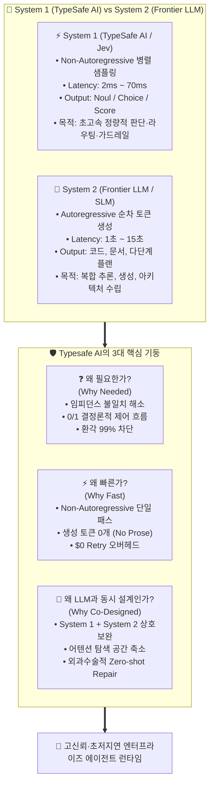
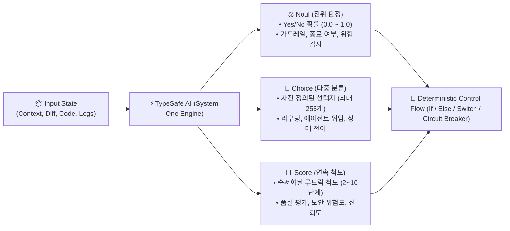
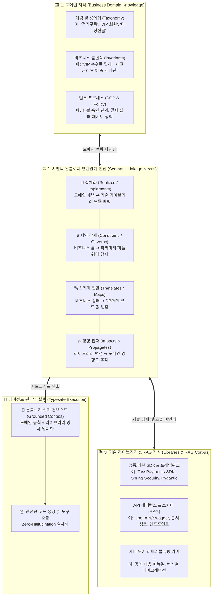
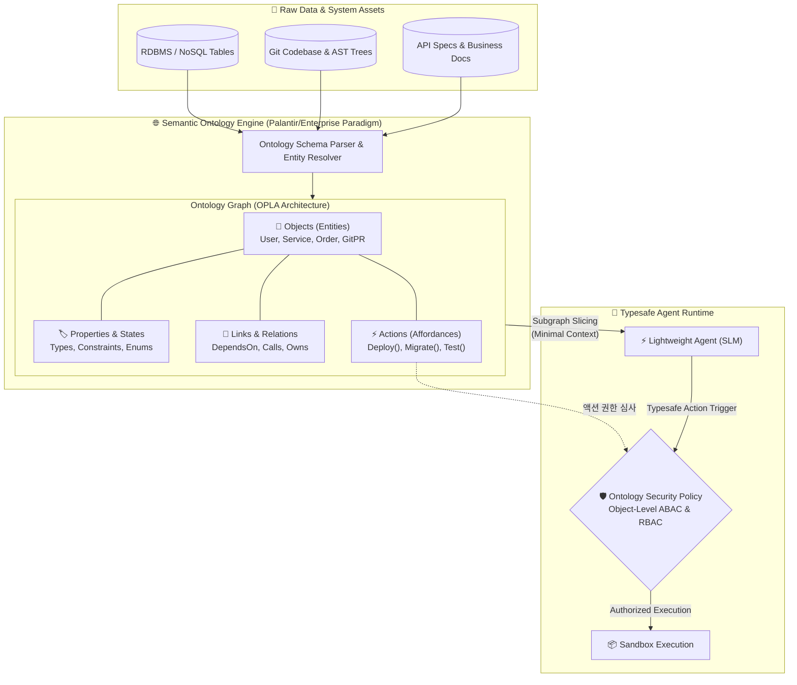
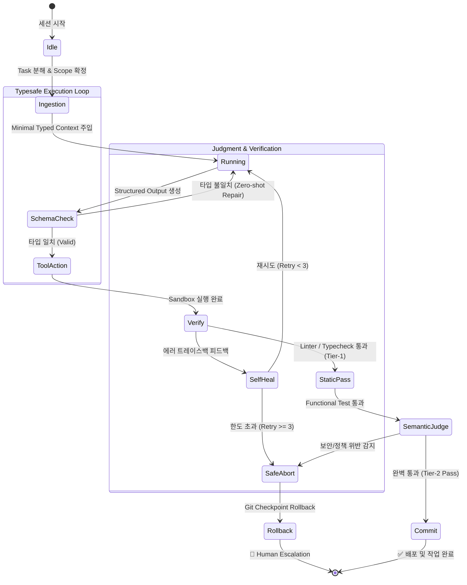
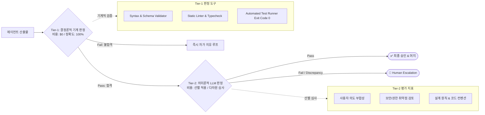

# 🛡️ AI Agent Governance & Harness Architecture (AAG v3.0)

> **"Autonomous Execution, Typesafe Contract, Semantic Ontology, Loop Engineering, Lightweight Model Optimization"**  
> 본 규정은 프로젝트 내 모든 AI 에이전트, 시맨틱 온톨로지(Ontology), 오케스트레이션 하네스(Harness), 런타임 제어 루프의 개발·운영 표준을 정의합니다.
>
> 📅 **Last Updated:** 2026-09-30 (v3.0 Typesafe & Semantic Ontology Edition)

---

### 💡 v3.0 핵심 아키텍처 패러다임 전환

기존 AI 에이전트 시스템이 초거대 언어 모델(Frontier LLM)의 자체 추론력과 비정형 자연어 프롬프트에 과도하게 의존했다면, **AAG v3.0**은 다음 **6대 엔지니어링 원칙**을 기반으로 안정적이고 경제적인 엔터프라이즈 자동화를 구현합니다:

1. **하네스 엔지니어링 (Harness Engineering):** *"Model is a commodity, Harness is the moat."* 모델 자체보다 에이전트를 둘러싼 실행 환경(샌드박스, 컨텍스트 슬라이싱, 상태 체크포인트, 결정론적 롤백)을 우선적으로 엔지니어링합니다.
2. **시맨틱 온톨로지 (Semantic Ontology & Actionable Graph):** 비정형 텍스트 청크나 파편화된 RAG를 넘어, 시스템의 객체(Object), 속성(Property), 관계(Link), 실행 가능한 행위(Action/Affordance)를 지식 그래프 온톨로지로 통합하여 에이전트의 지식 접지(Grounding)와 권한 통제를 완성합니다.
3. **루프 엔지니어링 (Loop Engineering):** 단순 `while true`의 무한 루프나 원시적 ReAct 패턴을 탈피하고, 유한 상태 머신(FSM) 기반의 수렴 보장, 조기 종료(Halting Guarantee), 서킷 브레이커를 강제합니다.
4. **Typesafe AI (타입 세이프 AI & 계약 우선주의):** 비정형 자연어 지시를 배제하고, 입력·도구 호출·최종 출력을 Pydantic, Zod, JSON Schema, TOON 등 엄격한 타입 계약으로 감싸 런타임 환각(Hallucination)을 원천 차단합니다.
5. **경량 모델(SLM / Flash) 최적화:** 엄격한 타입 제약, 온톨로지 서브그래프 슬라이싱, 최소 컨텍스트 주입을 결합하여, 경량 모델(SLM, Flash/Mini)로도 고비용 Frontier 모델 이상의 신뢰성과 처리 속도, 90% 이상의 비용 절감을 달성합니다.
6. **2단계 판정 이론 (Two-Tier Judgment Theory):** 비용 $0의 기계적·결정론적 판정(컴파일러, 린터, 테스트러너)을 1차 관문으로 두고, 검증된 결과에만 의미론적 평가(LLM-as-a-Judge)를 선별 적용하여 판정 신뢰도를 극대화합니다.

---

## 1. ⚖️ The Tram Constitution (AI 헌법 & 핵심 철학)

1. **Helpful & Harmless:** 윤리적·법적 선을 엄격히 준수한다. (Rate Limit 준수, 개인정보 및 보안 데이터 보호)
2. **Objectivity & Critical Thinking:** 사용자의 지시를 맹목적으로 따르지 않고, 기술적 결함이나 위험 요소를 사전에 객관적으로 조언한다.
3. **Honesty & Anti-Hallucination:** 모르는 것은 모른다고 명시하며, 검증되지 않은 가짜 정보를 철저히 배제한다.
4. **Builders > Solvers:** 단순 코드 생성 퍼즐을 넘어, 실제 기동하고 검증된 "동작하는 제품(Ship It)"을 산출한다.
5. **Contract-First & Typesafe Execution:** 자연어 설명보다 입출력 스키마(Typesafe Interface)와 기계적 검증(Test/Linter)을 최우선 기준으로 삼는다.
6. **Ontology-Grounded Action:** 추측에 의한 비즈니스 로직 조작을 금지하며, 정의된 온톨로지 스키마와 관계 제약(Invariants) 내에서만 데이터를 탐색하고 조작한다.
7. **Harness-Centric & Model-Agnostic:** 특정 거대 모델에 종속되지 않으며, 강건한 하네스, 온톨로지, 타입 시스템을 통해 경량 모델 환경에서도 일관된 품질을 보장한다.

---

## 2. 🗺️ End-to-End Agentic Product Architecture

사용자의 단일 자연어 요청이 수신되어 온톨로지 지식망 분석, RAG 검색, 모델 라우팅, 타입 세이프 하네스 실행, 2단계 판정을 거쳐 안전하게 커밋되기까지의 전체 아키텍처 흐름입니다.


---

## 3. 🧬 Typesafe AI & Schema-First Protocol

자연어 프롬프트는 확률적(Probabilistic)이며 모호합니다. 프로덕션 레벨의 에이전트는 입출력 경계가 반드시 **결정론적 타입(Deterministic Type)**과 **보정된 의사결정 프리미티브(Calibrated Decision Primitives)**로 고정되어야 합니다.

AAG v3.0은 최신 **TypeSafe AI (System One Architecture)** 패러다임을 전면 도입하여, 텍스트 생성 중심의 초거대 언어 모델(System 2 LLM)과 초고속 비자기회귀 의사결정 모델(System 1 Jev)을 결합한 하이브리드 타입 안전 아키텍처를 표준으로 채택합니다.

```text
[입력 State & 온톨로지] ──► [System 1 (TypeSafe Jev): Noul/Choice/Score] ──► [결정론적 라우팅/가드레일] ──► [System 2 (LLM): Typesafe Code Gen] ──► [컴파일 타임 검증]
```

---

### 1️⃣ Typesafe AI의 3대 본질: 당위성·속도·동시 설계



#### 💡 (1) 왜 필요한가? (The Inevitability of Typesafety)
1. **확률적 모델(LLM)과 결정론적 시스템(Runtime)의 임피던스 불일치 해소:**
   * LLM은 본질적으로 다음 토큰의 확률을 계산하는 통계적 언어 모델입니다. 그러나 OS, 데이터베이스, API, 런타임 환경은 `단 1비트의 타입 불일치`도 용납하지 않는 엄격한 결정론적 세계입니다.
   * 타입 안전성 없는 자연어 지시는 **포맷 드리프트(Format Drift)**, **필드 누락(Silent Drop)**, **유형 왜곡(Type Mismatch, e.g., 숫자 ID가 string으로 인출되어 연산 실패)**을 유발하여 시스템 장애로 직결됩니다.
2. **환각(Hallucination)의 원천 차단:**
   * 에이전트가 존재하지 않는 API 파라미터나 불가능한 상태 값을 지어내는 현상은 타입 스키마(Enum, Literal, Range Constraint)와 TypeSafe 의사결정 프리미티브로 경계를 묶을 때 99% 이상 소멸합니다.
3. **계약 우선주의 (Contract-First Architecture):**
   * 에이전트 간 협업(Multi-Agent Swarm)이나 도구 호출 시, 자연어 지침 대신 엄격한 스키마 인터페이스를 계약(Contract)으로 체결하여 시스템 결합도를 낮추고 모듈화된 기계적 검증을 가능하게 합니다.

#### ⚡ (2) 왜 빠른가? (The Extreme Velocity of Typesafe Inference)
Typesafe AI는 '안전성'뿐만 아니라 **기존 자연어 프롬프트 기반 에이전트 대비 10~100배 이상의 압도적 속도와 비용 절감**을 제공합니다:

1. **Non-Autoregressive 단일 포워드 패스 (Sub-50ms 의사결정):**
   * TypeSafe AI(Jev 모델 등)는 단어를 한 글자씩 이어붙이는 순차적 토큰 디코딩 루프(Autoregressive Decoding)를 완전히 배제합니다.
   * 입력 상태(State)와 질문(Question)에 대해 **단 1회의 신경망 포워드 패스로 사전 정의된 분류/회귀 헤드에서 확률 벡터를 병렬 인출**하므로, 로컬 2~10ms, 클라우드 API 기준 70~300ms 만에 응답을 반환합니다.
2. **잡담 토큰(Chatter/CoT Overhead) 제로 & 출력 토큰 비용 $0:**
   * 일반 LLM은 *"네, 요청하신 작업을 분석한 결과..."* 와 같은 장황한 서술(Chatter)을 생성하느라 수백 개의 토큰과 시간을 낭비합니다.
   * TypeSafe AI는 서술 텍스트를 일절 출력하지 않고 순수 정량값(0.0~1.0 확률, 인덱스, 점수)만 반환하므로, **생성 토큰 수가 0개이며 출력 토큰 비용이 발생하지 않습니다.**
3. **제약 디코딩 (Constrained Decoding & Logit Masking) 결합:**
   * LLM이 코드를 생성할 때도 스키마를 정규 문법(CFG)으로 변환하여 유효하지 않은 토큰의 로짓을 `-inf`로 마스킹하므로, 무효한 분기 탐색이 차단되어 디코딩 속도가 극대화됩니다.
4. **파싱 실패 재시도 오버헤드 제로 ($0 Retry Penalty):**
   * 정규식 파싱 오류나 마크다운 코드 블록 깨짐으로 인한 LLM 재호출 페널티가 원천 차단됩니다.

#### 🤝 (3) 왜 LLM과 함께 설계(Co-Design)되어야 하는가? (System 1 + System 2)
타입 시스템을 단순한 사후 유효성 검사기(Post-Validator)로만 두면 안 됩니다. **System 1(TypeSafe 결정 엔진)과 System 2(Frontier LLM)는 하네스 안에서 유기적으로 결합**되어야 합니다:

1. **어텐션 탐색 공간 축소 (Search Space Pruning):**
   * LLM의 어텐션 메커니즘은 프롬프트의 방대한 어휘 사전을 탐색합니다. 앞단에서 TypeSafe 결정 프리미티브가 도메인 의도와 타깃 온톨로지 객체를 확정해주면, LLM은 **수천 가지 가능성이 아니라 이미 좁혀진 특정 인터페이스와 코드 블록에만 어텐션을 집중**할 수 있습니다.
2. **외과수술적 자가 복구 (Zero-shot Surgical Repair):**
   * 코드 생성 결과에서 타입 위반이 발생하더라도, 전체 맥락을 처음부터 다시 생성하지 않습니다.
   * `Pydantic`/`Zod`의 정밀한 에러 위치(`loc: ["payload", "exit_code"]`, `expected: integer`, `received: string "0"`)만 모델에 피드백으로 주입하여, **1턴(단 0.5초) 만에 잘못된 필드만 외과수술적으로 교정**합니다.
3. **기계와 지능의 분업 (Harness Co-design):**
   * **System 1 (TypeSafe AI):** "이 요청이 보안 정책을 위반하는가?(Noul)", "어느 플러그인으로 라우팅할 것인가?(Choice)", "현재 코드 품질 점수는?(Score)" 등 매 턴마다 발생하는 수많은 조건 분기를 초고속·저비용으로 판정.
   * **System 2 (LLM):** System 1의 판정을 통과한 핵심 로직에 대해서만 실제 코드 작성 및 복합 아키텍처 추론을 전담.
   * 이를 통해 전체 에이전트 시스템의 **지연시간은 80% 단축되고, 토큰 비용은 90% 이상 절감**됩니다.

---

### 2️⃣ TypeSafe AI 3대 의사결정 프리미티브 (Decision Primitives: Noul, Choice, Score)

TypeSafe AI(Jev 모델)는 소프트웨어가 조건문(`if/else`), 분기문(`switch`), 가드레일, 정책 게이트에 직접 꽂아 쓸 수 있는 **3대 원자적 의사결정 프리미티브**를 제공합니다:



#### 1. `Noul` (진위 판정 / Boolean Probability Primitive)
* **정의:** 특정 명제(Proposition)나 조건이 **참(True)일 확률을 0.0 ~ 1.0의 통계적으로 보정된 확률값(Calibrated Probability)**으로 반환하는 이진 판정 프리미티브입니다.
* **주요 용도:**
  - **보안/정책 가드레일:** `"이 코드가 프로덕션 DB 삭제 명령을 포함하는가?"`
  - **루프 조기 종료 판단:** `"현재 테스트 결과가 요구사항을 완벽히 충족하는가?"`
  - **인간 개입 트리거 (Escalation):** `"이 변경사항이 관리자 승인을 필요로 하는가?"`
* **반환 구조:**
  ```json
  {
    "urgent": {
      "value": true,
      "probability": 0.942,
      "confidence": 0.915
    }
  }
  ```

#### 2. `Choice` (범주 선택 / Categorical Classification Primitive)
* **정의:** 사전 정의된 선택지 세트(최대 255개) 중 주어진 상태에 **가장 부합하는 옵션 하나를 선택하고 각 후보별 확률 분포(Probability Distribution)를 제공**하는 다중 분류 프리미티브입니다.
* **주요 용도:**
  - **인텐트 기반 에이전트 라우팅:** `{"dev": "코드 수정", "security": "권한 심사", "data": "온톨로지 쿼리"}`
  - **FSM 상태 전이 제어:** `{"PROCEED_TO_EVAL": "테스트 통과", "REQUEST_RETRY": "재시도", "TRIGGER_ROLLBACK": "실패 롤백"}`
  - **도구/API 선택:** 실행할 하네스 액션 결정
* **반환 구조:**
  ```json
  {
    "route": {
      "chosen": "dev",
      "probabilities": {
        "dev": 0.884,
        "security": 0.091,
        "data": 0.025
      },
      "confidence": 0.852
    }
  }
  ```

#### 3. `Score` (순서화 척도 평가 / Continuous Rubric Primitive)
* **정의:** 2단계부터 10단계까지 정의된 순서화된 루브릭(Rubric)에 따라 **대상의 품질, 심각도, 적합성을 연속형 점수로 평가**하는 정량 척도 프리미티브입니다.
* **주요 용도:**
  - **Tier-2 코드 품질 심사:** 1단계(불량)부터 5단계(완벽)까지의 코드 안정성 점수
  - **보안 취약점 심각도 (CVSS 유사 척도):** 1(안전) ~ 10(치명적 익스플로잇)
  - **온톨로지 지식 적합도 (Grounding Score):** 도메인 지식 부합도 정량화
* **반환 구조:**
  ```json
  {
    "code_quality": {
      "score": 4.62,
      "levels": 5,
      "distribution": [0.01, 0.02, 0.05, 0.22, 0.70],
      "confidence": 0.890
    }
  }
  ```

---

### 3️⃣ TypeSafe AI 공식 SDK 연동 예시

TypeSafe AI는 Python 및 TypeScript 공식 SDK를 통해 상태(State)와 질문(Questions)을 전달받아 즉시 결정론적 응답을 인출합니다:

#### 🐍 Python SDK (`typesafe-sdk`)
```python
from typesafe_sdk import TypeSafeClient, Noul, Choice, Score

client = TypeSafeClient()

# 1. 검증할 상태 데이터 (코드 변경 및 테스트 로그)
state_payload = {
    "task_id": "TASK-03",
    "diff": "- old_auth()\n+ new_jwt_auth()",
    "test_exit_code": 0,
    "changed_files": ["src/auth/jwt.py"]
}

# 2. TypeSafe AI 프리미티브 질의 (Noul, Choice, Score 동시 평가)
decisions = client.system_one(
    state=state_payload,
    questions={
        # Noul: 보안 위험 탐지 (가드레일)
        "is_safe": Noul(instructions="이 변경사항이 보안 취약점이나 비밀키 유출을 유발하지 않는가?"),
        
        # Choice: 다음 FSM 상태 전이 라우팅
        "next_action": Choice(
            instructions="테스트 결과와 변경 범위를 고려할 때 다음 하네스 조치는?",
            criteria={
                "auto_commit": "테스트 통과 및 안전 검증 완료",
                "retest": "추가 단위 테스트 필요",
                "human_review": "보안 위험으로 관리자 승인 필요"
            }
        ),
        
        # Score: 5단계 코드 품질 심사
        "code_stability": Score(
            instructions="코드 변경의 안정성 및 컨벤션 준수도를 1(취약)부터 5(견고)까지 평가하라",
            levels=5
        )
    }
)

# 3. 결정론적 제어 흐름 (Control Flow) 실행
if not decisions["is_safe"].value or decisions["is_safe"].probability < 0.90:
    print(f"🚨 보안 가드레일 경고: 신뢰도 {decisions['is_safe'].confidence}")
elif decisions["next_action"].chosen == "auto_commit":
    print(f"✅ 자동 커밋 승인 (품질 점수: {decisions['code_stability'].score}/5.0)")
```

#### 🌐 TypeScript SDK (`@typesafe-ai/sdk`)
```typescript
import { TypeSafeClient, noul, choice, score } from "@typesafe-ai/sdk";

const client = new TypeSafeClient();

const result = await client.systemOne({
  state: {
    user_request: "결제 취소 처리해줘",
    order_status: "COMPLETED",
    elapsed_days: 3
  },
  questions: {
    can_refund: noul("주문 상태와 경과일을 고려할 때 환불 승인 조건을 충족하는가?"),
    escalate_reason: choice("환불 불가 시 사유 분류", {
      expired: "환불 가능 기간(7일) 경과",
      already_refunded: "이미 환불 완료됨",
      valid_to_proceed: "정상 환불 가능"
    }),
    fraud_risk: score("이상 결제 의심 위험도 (1: 안전 ~ 5: 위험)", 5)
  }
});

if (result.can_refund.value && result.fraud_risk.score < 2.0) {
  // 고속 자동 환불 액션 실행 (소요시간: 70ms)
}
```

---

### 4️⃣ AAG 하네스 표준 응답 기준 (Response Protocol Criteria)

모든 에이전트 간 통신과 도구 실행 결과는 다음 **4대 응답 기준**을 엄격히 준수해야 합니다:

| 기준 항목 | 요구사항 및 표준 규약 | 위반 시 하네스 조치 |
| :--- | :--- | :--- |
| **1. Envelope Wrapping** | 모든 응답은 `trace_id`, `status`, `timestamp`, `metrics`, `payload`를 감싸는 최상위 표준 봉투(Envelope)를 필수로 포함 | 비정형 원시 데이터 반환 시 즉시 거절 및 래핑 강제 |
| **2. Discriminated Union** | 다형적 응답은 `kind` 필드를 태그로 두어 런타임 패턴 매칭 및 완벽한 정적 타입 가드(Type Guard) 지원 | 불명확한 다형성 감지 시 스키마 유효성 실패 처리 |
| **3. Deterministic Exit** | 태스크 수행 결과는 반드시 표준 숫자형 `exit_code` (0: 성공, 비0: 에러 코드)와 FSM 전이 신호를 명시 | 성공/실패 여부가 모호한 자연어 응답 원천 차단 |
| **4. Zero Chatter Guarantee** | 마크다운 코드 블록(```)이나 부가 인사말 없이 순수 역직렬화 가능한 구조화 데이터(JSON/TOON)만 스트림 | 정규식 프리프로세서 또는 파서 레벨에서 사전 필터링 |

---

### 5️⃣ 핵심 타입 카탈로그 (Core Type System Catalog)

AAG v3.0 하네스에서 에이전트 런타임이 운용하는 5대 표준 타입 정의입니다:

#### 1. `AgentResponseEnvelope<T>` (최상위 표준 응답 봉투)
```typescript
interface AgentResponseEnvelope<T> {
  trace_id: string;              // 세션 및 분산 추적 고유 ID (UUID v4)
  task_id: string;               // 현재 실행 중인 서브태스크 ID
  sender: "tram" | "dev" | "data" | "security" | "user"; // 발신 주체
  status: "SUCCESS" | "FAILURE" | "REPAIR_REQUIRED" | "HALTED";
  timestamp: string;             // ISO-8601 UTC
  metrics: {
    latency_ms: number;          // 모델 응답 지연시간 (TypeSafe AI: 2~70ms, LLM: 1000~5000ms)
    tokens_consumed: number;     // 소모된 토큰 총량
    turn_index: number;          // 서브태스크 내 현재 턴 (1~5)
  };
  payload: T;                    // 실제 타입화된 본문 데이터
}
```

#### 2. `TaskExecutionResult` (작업 실행 결과 명세)
```typescript
interface TaskExecutionResult {
  exit_code: number;             // 0: 완벽 성공, 1+: 실패
  affected_files: string[];      // 수정된 파일 목록 (최대 5개 제한 준수 확인용)
  verification_command: string;  // 검증에 사용된 단일 명령어 (e.g., 'pytest tests/test_user.py')
  stdout_summary: string;        // 실행 요약 로그 (최대 500자 압축)
  error_trace?: string;          // 실패 시 에러 트레이스백
  rollback_checkpoint?: string;  // 생성된 Git 체크포인트 해시 (e.g., 'chk_a8f9c1')
}
```

#### 3. `ToolCallAction` (도구 실행 권능 명세 - Discriminated Union)
```typescript
type ToolCallAction = 
  | { kind: "FILE_WRITE"; path: string; content: string; overwrite: boolean }
  | { kind: "FILE_PATCH"; path: string; search_block: string; replace_block: string }
  | { kind: "SHELL_EXEC"; command: string; timeout_sec: number; env_vars?: Record<string, string> }
  | { kind: "ONTOLOGY_QUERY"; target_entity: string; max_hops: 1 | 2; filter_expr?: string }
  | { kind: "TYPESAFE_DECISION"; questions: Record<string, "NOUL" | "CHOICE" | "SCORE"> }
  | { kind: "HUMAN_ESCALATE"; reason_code: "SECURITY" | "ARCH_CORE" | "RETRY_LIMIT"; message: string };
```

#### 4. `StateTransitionSignal` (루프 제어 및 FSM 전이 명세)
```typescript
interface StateTransitionSignal {
  current_state: "INGESTION" | "RUNNING" | "EVAL_GATE" | "SELF_HEAL";
  next_transition: "PROCEED_TO_EVAL" | "REQUEST_RETRY" | "TERMINATE_SUCCESS" | "TRIGGER_ROLLBACK";
  reason: string;
  cycle_detected: boolean;       // 동일 에러 2회 이상 반복 감지 여부
  circuit_breaker_tripped: boolean; // 토큰/턴 한도 초과 여부
}
```

#### 5. `ZeroShotRepairPayload` (타입 복구 전용 스니펫)
```typescript
interface ZeroShotRepairPayload {
  error_type: "SCHEMA_VALIDATION_ERROR";
  failed_loc: (string | number)[]; // 에러 발생 경로 (e.g. ['payload', 'exit_code'])
  expected_rule: string;          // 기대 타입 및 제약 (e.g. 'integer in range [0, 255]')
  actual_value_dump: string;      // 실제 수신된 잘못된 값
  fix_instruction: string;        // 1문장 직관적 수정 지시문
}
```

---

### 6️⃣ 구현 예시: Pydantic v2 & Zod 스키마

```python
# Python Pydantic v2 구현 예시 (Agent Backend & Harness)
from pydantic import BaseModel, Field, conint, constr
from typing import Literal, List, Optional
from datetime import datetime

class TaskExecutionResultModel(BaseModel):
    task_id: constr(pattern=r"^TASK-\d{2}$") = Field(..., description="태스크 고유 식별자")
    exit_code: conint(ge=0, le=255) = Field(..., description="프로세스 종료 코드 (0=성공)")
    affected_files: List[str] = Field(..., max_length=5, description="수정된 파일 목록 (원자적 작업 5개 제한)")
    verification_command: str = Field(..., description="기계적 검증 커맨드")
    status: Literal["SUCCESS", "FAILED", "BLOCKED"]
    created_at: datetime = Field(default_factory=datetime.utcnow)

    class Config:
        frozen = True # 불변 객체로 보장
```

```typescript
// TypeScript Zod 구현 예시 (Agent Client & Web Gateway)
import { z } from 'zod';

export const TaskExecutionResultSchema = z.object({
  task_id: z.string().regex(/^TASK-\d{2}$/, "TASK-XX 형식이어야 합니다."),
  exit_code: z.number().int().min(0).max(255),
  affected_files: z.array(z.string()).max(5, "원자적 변경 원칙: 1회 최대 5개 파일로 제한됩니다."),
  verification_command: z.string().min(1, "검증 명령어는 필수입니다."),
  status: z.enum(["SUCCESS", "FAILED", "BLOCKED"]),
  created_at: z.string().datetime()
});

export type TaskExecutionResult = z.infer<typeof TaskExecutionResultSchema>;
```

#### 📋 실제 모델 출력 JSON 인출 예시
```json
{
  "trace_id": "9b1deb4d-3b7d-4bad-9bdd-2b0d7b3dcb6d",
  "task_id": "TASK-03",
  "sender": "dev",
  "status": "SUCCESS",
  "timestamp": "2026-09-30T02:25:00Z",
  "metrics": {
    "latency_ms": 612,
    "tokens_consumed": 184,
    "turn_index": 1
  },
  "payload": {
    "task_id": "TASK-03",
    "exit_code": 0,
    "affected_files": [
      "src/auth/jwt_provider.py",
      "tests/test_jwt_provider.py"
    ],
    "verification_command": "pytest tests/test_jwt_provider.py -v",
    "status": "SUCCESS",
    "created_at": "2026-09-30T02:24:59Z"
  }
}
```

---

## 4. 🌐 Semantic Ontology & Knowledge Graph Architecture

전통적인 검색 증강 생성(Naive RAG)은 텍스트를 단순히 청크(Chunk)로 쪼개어 유사도 순으로 던져줍니다. 하지만 복잡한 시스템에서 에이전트가 "진짜 작업"을 수행하려면, **도메인 지식(Domain Knowledge)**, **기술 라이브러리 및 SDK(RAG Corpus)**, 그리고 이들 사이의 **의미론적 연관관계(Semantic Linkage)**를 완벽히 이해해야 합니다.

Tram AAG는 **시맨틱 온톨로지(Semantic Ontology)**를 도메인 의도와 기술적 구현 자산을 결속하는 핵심 브릿지이자 에이전트 행동의 기준틀(Ground Truth)로 삼습니다.

---

### 1️⃣ 지식의 3대 축과 온톨로지 넥서스 (The Knowledge Triad & Ontology Nexus)

에이전트가 엔터프라이즈 환경에서 환각 없이 올바르게 기동하기 위해서는 상호 독립된 3가지 지식 자산이 온톨로지를 통해 결속되어야 합니다:



1. **🏛️ 도메인 지식 (Business Domain Knowledge - "WHAT & WHY"):**
   - 회사의 비즈니스 룰, 도메인 불변식(Invariants), 사내 고유 용어집(Taxonomy/Glossary), 업무 절차(SOP).
   - "누가, 언제, 어떤 조건에서 이 데이터를 조작할 수 있는가?"를 정의합니다.
2. **📚 기술 라이브러리 & RAG 지식 (Libraries & Tech Corpus - "HOW & TOOLS"):**
   - 사내/오픈소스 SDK, 기술 프레임워크(Spring, FastAPI, React 등), API 명세서, 트러블슈팅 런북.
   - RAG 벡터 및 키워드로 인덱싱된 "실제 구동 가능한 기술적 도구들의 집합"입니다.
3. **🌐 시맨틱 온톨로지 연관관계 (Semantic Linkage - "THE BRIDGE"):**
   - **Naive RAG가 실패하는 근본 원인:** "도메인 맥락 없는 라이브러리 RAG 검색"은 엉뚱한 파라미터 호출을 낳고, "기술 라이브러리 바인딩 없는 도메인 지식"은 실행 불가능한 자연어 환각만 낳습니다.
   - **온톨로지의 역할:** 도메인 개념과 기술 라이브러리 API, 데이터베이스 스키마 간의 **"의미론적 연관관계(Semantic Linkage)"를 명시적 유향 그래프로 바인딩**합니다.

---

### 2️⃣ 온톨로지 핵심 연관관계 (Semantic Relationship) 4대 유형

온톨로지는 도메인 지식과 기술 라이브러리를 연결하기 위해 다음 4가지 핵심 엣지(Edge) 관계를 유지합니다:

| 연관관계 유형 | 의미 및 메커니즘 | 실제 적용 예시 |
| :--- | :--- | :--- |
| **1. 실체화 (Realizes / Implements)** | 추상적인 비즈니스 개념/행위가 특정 기술 라이브러리의 클래스/함수/API로 어떻게 구현되는지 연결 | 도메인 개념 `정기결제(SubscriptionBilling)` ──[Realizes]──► 라이브러리 `TossPaymentsSDK.requestBillingAuth()` |
| **2. 제약 강제 (Constrains / Governs)** | 비즈니스 불변식(Invariants)이 라이브러리의 어떤 파라미터나 보안 미들웨어로 강제되어야 하는지 정의 | 도메인 룰 `중복결제 차단` ──[Constrains]──► 라이브러리 헤더 `Idempotency-Key` 및 `RedisDistributedLock` 강제 |
| **3. 스키마 변환 (Translates / Maps)** | 비즈니스 상태/용어와 라이브러리/데이터베이스의 물리적 코드 값 사이의 양방향 매핑 규정 | 비즈니스 개념 `활성 구독 상태` ──[Translates]──► DB 칼럼 `sub_status == '01'` & `expires_at > NOW()` |
| **4. 영향 전파 (Impacts & Propagates)** | 외부 라이브러리 버전 업그레이드나 도메인 정책 변경 시 영향받는 상/하위 컴포넌트 자동 추적 | `Stripe SDK v12 ➔ v13 업데이트` ──[Impacts]──► 도메인 엔티티 `PaymentMethod`의 토큰화 암호화 규약 변경 추적 |

---

### 3️⃣ OPLA: 온톨로지 4대 런타임 구성 요소

온톨로지 엔진은 도메인 지식과 라이브러리를 바탕으로 엔터프라이즈 환경을 4가지 실행 단위(OPLA)로 인덱싱합니다:



* **Objects (객체/엔티티):** 실재하는 고유 식별 비즈니스/기술 단위 (`DatabaseTable`, `MicroService`, `BillingAccount`, `PullRequest`).
* **Properties (속성/상태):** 객체의 정적 메타데이터, 동적 런타임 상태 및 타입 제약 (`status: "ACTIVE"`, `schema_version: 3`).
* **Links (의미론적 연결):** 객체 간의 종속성, 상속, 인과 관계를 나타내는 유향 엣지 (`ServiceA --(Calls)--> ServiceB`).
* **Actions (실행 권능/Affordances):** 특정 객체에 대해 에이전트가 호출할 수 있는 타입화된 도구 (`User.refund()`, `Service.restart()`).

---

### 4️⃣ 온톨로지 지식 접지 (Ontology Grounding) vs Naive RAG

* **관계적 일관성 보장:** Naive RAG는 텍스트 유사도만 보므로 A서비스와 B서비스의 의존 순서를 뒤바꿀 수 있습니다. 온톨로지는 그래프 탐색(Graph Traversal)을 통해 `DependsOn` 방향성을 100% 보장합니다.
* **불변식(Business Invariants) 강제:** "결제 취소는 주문 상태가 PENDING_PAYMENT 또는 COMPLETED일 때만 가능하다"와 같은 비즈니스 규칙이 온톨로지 링크/제약조건으로 사전 선언되어 있어 에이전트의 불법 상태 전이를 차단합니다.
* **라이브러리 정확도 보장:** 도메인 의도와 연계된 정확한 SDK 명세만 선별 인출되므로, 버전 불일치나 deprecated된 라이브러리 API 호출을 방지합니다.

---

### 5️⃣ 온톨로지 서브그래프 슬라이싱 & 경량 모델(SLM) 연계

* 에이전트에게 전체 온톨로지를 주지 않습니다. 에이전트가 처리할 작업과 직접 연관된 **1~2홉(Hop) 반경의 도메인-라이브러리 서브그래프(Subgraph)**만 추출하여 전달합니다.
* 이 경량화된 그래프 스냅샷은 4KB 미만의 토큰만 차지하면서도 도메인 규칙과 라이브러리 명세를 일체화하여 제공하므로, **경량 모델(SLM/Flash)이 복잡한 엔터프라이즈 추론에서도 환각 없이 작업을 완수**할 수 있습니다.

---

### 6️⃣ 온톨로지 기반 객체 수준 보안 및 권한 통제 (Object-Level RBAC/ABAC)

* 단순 API 키나 파일 권한을 넘어, **"어떤 에이전트가 어떤 온톨로지 객체(Object)에 대해 어떤 액션(Action)을 트리거할 수 있는가"**를 온톨로지 레이어에서 중앙 통제합니다.
* 예: `Dev Agent`는 `Service.restart()` 액션 권한이 있지만, `BillingAccount.charge()` 액션 권한은 온톨로지 보안 정책에 의해 원천 차단됩니다.

---

## 5. ⚙️ Harness & Loop Engineering

에이전트의 성공을 좌우하는 것은 모델의 크기가 아니라, 모델을 감싸고 있는 **실행 하네스(Harness)**와 **제어 루프(Loop)**의 정밀함입니다.

### 1️⃣ 하네스 엔지니어링 (Harness Engineering)
* **Context Slicing (컨텍스트 슬라이싱):** 전체 저장소를 통째로 모델에 주입하지 않습니다. 하네스는 온톨로지 서브그래프와 AST(구문 트리) 분석을 바탕으로 수정 대상 파일과 직접 관련된 인터페이스만 칼로 베어내듯 슬라이싱하여 주입합니다.
* **Sandbox Isolation (격리 샌드박스):** 에이전트의 모든 파일 변경 및 명령어 실행은 격리된 작업 디렉터리 및 Git 임시 브랜치에서 실행됩니다.
* **Deterministic Rollback (결정론적 롤백):** 작업 전 `git checkpoint`를 자동 생성하며, 검증 실패 시 `git reset --hard` 및 클린업을 통해 시스템을 오염 없이 즉시 원상 복구합니다.

### 2️⃣ 루프 엔지니어링 (Loop Engineering)
* **FSM (유한 상태 머신) 기반 제어:** 에이전트의 실행은 단순 `while` 루프가 아닌 명확한 상태(State) 전이 머신으로 통제됩니다.
* **Halting Guarantee (종료 보장):** 
  - 서브태스크당 **최대 5턴** 엄격 제한.
  - 동일한 에러 메시지가 2회 연속 발생할 경우(Cycle Detection) 즉시 루프를 탈출하고 계획 재수립 단계로 전이.
* **Circuit Breaker (서킷 브레이커):** 누적 토큰 소비량 또는 연속 실패 횟수가 임계치를 초과하면 하네스가 강제로 세션을 일시 중단하고 인간에게 통제권을 넘깁니다.



---

## 6. ⚡ Lightweight Model (SLM/Flash) Optimization

대규모 엔터프라이즈 환경에서 모든 태스크에 초거대 모델(Frontier LLM)을 사용하는 것은 비용과 지연시간 측면에서 비효율적입니다. **AAG v3.0은 경량 모델(SLM, Flash/Mini)을 1급 시민으로 최적화**합니다.

| 비교 항목 | 기존: Frontier LLM 중심 접근 | AAG v3.0: 온톨로지 하네스 + 경량 모델 |
| :--- | :--- | :--- |
| **주요 사용 모델** | GPT-4o, Claude 3.5 Sonnet, Gemini Pro | **Gemini Flash, Claude Haiku, Llama-3-8B / 로컬 SLM** |
| **비용 (Cost)** | 고비용 ($3.00 ~ $15.00 / 1M 토큰) | **초저비용 ($0.075 ~ $0.50 / 1M 토큰, 90% 이상 절감)** |
| **응답 지연시간 (Latency)** | 5초 ~ 20초 (복합 추론 시 지연 심화) | **0.5초 ~ 2초 (실시간 인터랙티브 실행 가능)** |
| **환각 방지 기제** | 모델의 "자체 주의력(Self-Attention)"에 의존 | **온톨로지 그래프 제약 + 스키마 하네스로 원천 차단** |
| **성공률 확보 방식** | 한 번에 많은 일을 시킴 (Complex Prompting) | **온톨로지 서브태스크 분해 + 3단계 기계 검증 루프** |

### 🚀 경량 모델 성능 극대화 공식
$$\text{Reliability} = \text{Lightweight Model} + \text{Semantic Ontology} + \text{Strict Typesafe Schema} + \text{Deterministic Harness}$$

1. **탐색 공간(Search Space) 축소:** 자유 텍스트 대신 온톨로지의 `Enum`, `Strict Schema`, `Typed Actions`를 제공하여 경량 모델이 엉뚱한 결정을 내릴 수 있는 확률을 0으로 수렴시킵니다.
2. **Context Pruning (컨텍스트 다이어트):** 경량 모델의 주의력 저하(Needle-in-a-Haystack 한계)를 방지하기 위해 4KB 이내의 핵심 온톨로지 서브그래프와 인터페이스만 주입합니다.
3. **Model Cascading (계층형 모델 라우팅):**
   - **Frontier Model:** 전체 시스템 온톨로지 설계, 모호한 요구사항의 DAG 분해 (1회성 수행).
   - **Lightweight SLM/Flash:** 각 서브태스크의 실제 코드 작성, 변환, 단위 테스트 구현, 린트 수정 (수십~수백 회 고속 반복).
   - **Deterministic Harness:** 실행, 컴파일, 테스트 판정 (비용 0, 모델 미사용).

---

## 7. 🎯 Hybrid RAG & 2-Tier Judgment Theory

에이전트가 올바른 결정을 내리고, 그 결정이 올바른지 평가하는 **지식 검색(RAG)**과 **판정(Judgment)** 이론을 규정합니다.

### 1️⃣ Graph-Aware Hybrid RAG
단순한 텍스트 임베딩 기반 검색은 코드베이스와 시스템의 복잡한 의존성을 놓칩니다. Tram AAG는 3단계 하이브리드 검색을 표준으로 채택합니다:
* **Dense Vector Search:** 의미론적 자연어 의도 검색 (API 명세서, 가이드 문서).
* **Sparse BM25 Search:** 정확한 식별자, 에러 코드, 함수 심볼 매칭.
* **Ontology Graph & AST Search:** 온톨로지 관계망과 함수 호출 관계(Caller/Callee), 인터페이스 상속 구조를 따라 관련 코드를 누락 없이 수집.

### 2️⃣ 2-Tier Judgment Gate (2단계 판정 체계)

판정 비용과 정확도의 최적 트레이드오프를 위해 2단계 게이팅을 적용합니다.



* **Tier-1: 결정론적 기계 판정 (Deterministic Judges)**
  - 비용: **$0**, 소요 시간: 밀리초(ms) 단위, 확실성: **100%**.
  - 스키마 유효성, 타입체커(mypy/tsc), 린터(ruff/eslint), 단위 테스트 러너의 **Exit Code 0** 여부로 기계적 합격 판정.
  - *Tier-1을 통과하지 못한 산출물은 Tier-2 LLM 평가 단계로 진입할 수 없습니다.*
* **Tier-2: 의미론적 평가 (Semantic LLM-as-a-Judge)**
  - Tier-1을 통과한 안정된 코드에 한해, 루브릭(Rubric)에 따른 사용자 의도 부합성, 보안 취약점, 아키텍처 정합성을 심사합니다.
  - 중요 변경점이 아닐 경우 Tier-2를 생략하여 토큰 비용과 대기 시간을 대폭 절감합니다.

---

## 8. 🔄 APEI-H (Harness-Driven) Protocol

모든 작업 단위는 APEI-H 파이프라인에 따라 분해 및 격리 실행됩니다.

```text
[ANALYZE: 온톨로지/맥락 분석] ──► [PLAN: DAG & 검증식 수립] ──► [EXECUTE: 격리 세션 실행] ──► [ITERATE: 3단계 자동 검증 & 롤백]
```

### 1️⃣ Analyze (분석 및 온톨로지 매핑)
* **Action:** 요구사항 구체화, 관련 온톨로지 서브그래프 확보, 대상 소스 코드 분석, 리서치.
* **Harness Rule:**
  * "조사 없는 추측 기반 코딩 금지".
  * 모호한 요구사항은 가정으로 때우지 않고 즉시 명확화 질의를 수행한다.

### 2️⃣ Plan (설계 및 작업 분해)
* **Action:** 작업을 3~10개의 독립 실행 가능한 하위 태스크(DAG)로 분해.
* **Harness Rule:**
  * 각 태스크는 (1) 입출력 스키마, (2) 수정 허용 파일(`Allowed Scope`), (3) 단일 검증 명령어(`verification_command`)를 필수로 포함해야 한다.

### 3️⃣ Execute (격리 샌드박스 실행)
* **Action:** 파일 수정, 코드 구현, 셸 명령어 수행.
* **Harness Rule:**
  * **Context Isolation:** 서브태스크별로 세션을 분리하여 대화 히스토리 오염을 방지하고 필요한 컨텍스트만 주입한다.
  * **Atomic Changes:** 한 번에 하나의 기능 단위만 수정하며, 한 작업당 최대 5개 파일 수정을 초과하지 않는다.
  * **Forbidden Scope:** 프로젝트 설정, 환경변수, 보안 키 등 `Forbidden Scope`로 지정된 영역은 사전 승인 없이 수정할 수 없다.

### 4️⃣ Iterate (자가 치유 및 결정론적 검증)
* **Action:** 린트, 타입체크, 단위/통합 테스트 자동 실행.
* **Harness Rule:**
  * 사람의 육안 검수 대신 **테스트 러너의 Exit Code 0**을 확인하여 완료 여부를 판단한다.
  * 실패 시 에러 트레이스백을 기반으로 최대 3회까지 자가 수정(Self-Healing)을 수행하며, 초과 실패 시 자동 롤백 후 상태를 보고한다.

---

## 9. 🪝 Deterministic Hook Lifecycle

워크플로우 단계 전이와 품질 검증은 5대 훅(Hook) 시스템에 의해 자동 제어됩니다.

```text
UserPromptSubmit ──► PreExecution ──► [ Execution ] ──► PostToolUse ──► WorkerVerify ──► Stop / Transition
      │                     │                                 │               │                 │
 (상태 초기화)         (입력/계획 검증)                  (타입/스키마 검증)   (Tier-1/2 검증)   (커밋 or 롤백)
```

### 훅별 정의 및 책임

| Hook Name | Trigger | 책임 및 액션 | 실패 시 동작 |
| :--- | :--- | :--- | :--- |
| **`UserPromptSubmit`** | 사용자 입력 수신 시 | 세션 컨텍스트 로딩, 온톨로지 바인딩, 작업 파이프라인 초기화 | 입력 재요청 |
| **`PreExecution`** | Execute 단계 진입 전 | `PLAN.md` 존재 확인, 의존성 충족 및 리소스 접근성 검증 | 실행 차단 및 계획 수정 |
| **`PostToolUse`** | 도구/파일 수정 직후 | **Typesafe 스키마 검증**, 비정상적 전역 변경(`Forbidden Scope`) 탐지 | 도구 실행 취소 및 Zero-shot 수리 |
| **`WorkerVerify`** | 작업 완료 직후 | **3단계 결정론적 검증 실행**<br>1. Static (타입체크/린트)<br>2. Runtime (빌드 성공 여부)<br>3. Functional (단위/통합 테스트) | 자가 치유 루프 진입 (최대 3회) |
| **`Stop`** | 단계 완료 시 | **Pass**: 자동 Git Commit 및 다음 태스크 전이<br>**Fail**: 작업 브랜치 자동 롤백(`git reset --hard`) 및 Human 알림 | 안전 중단 (Safe Abort) |

---

## 10. 🛑 Resource Limits & Human Escalation Rules

### 📏 Resource Limits (안전 자원 한도)
* **Max Task Turns:** 단일 서브태스크당 최대 5턴 (초과 시 즉시 작업 중단 및 분해)
* **Max Self-Healing Retries:** 검증 실패 시 최대 3회 재시도 (초과 시 즉시 롤백)
* **Scope Boundary:** 단일 커밋당 수정 파일 수 최대 5개 이내 권장
* **Circuit Breaker:** 단일 태스크 토큰 소모량 임계치 초과 또는 루프 감지 시 강제 중단

### 🚨 Human Escalation Triggers (인간 승인 필수 영역)
다음 상황 발생 시 AI는 작업을 일시 정지하고 반드시 인간(관리자)에게 결정을 위임해야 합니다:

1. **아키텍처 및 코어 변경:** DB 스키마 삭제/마이그레이션, 핵심 프레임워크/라이브러리 메이저 버전 업데이트.
2. **보안 및 권한:** 인증/인가 로직의 근본적 변경, 외부 접근 권한 부여, 환경 변수/비밀키 갱신.
3. **비용 및 외부 통신:** 유료 외부 API 호출, 대량 이메일/메시지 발송, 프로덕션 배포.
4. **치유 실패:** `WorkerVerify` 3회 재시도 후에도 테스트를 통과하지 못할 때.

---

## 11. ⚡ Token Efficiency: TOON Protocol

대량 데이터 입출력 시 토큰 낭비와 환각을 줄이기 위해 **TOON (Token-Oriented Object Notation)** 포맷을 표준으로 채택합니다.

* **원칙:** 불필요한 JSON 키 반복을 제거하고, 압축된 헤더-행 구조를 사용하여 처리 속도와 정확도를 향상시킵니다.
* **온톨로지 및 경량 모델과의 시너지:** 키 반복이 제거된 평탄화 구조는 온톨로지 데이터 쿼리 결과를 경량 모델(SLM)에 주입할 때 컨텍스트 윈도우 부담을 40~60% 경감시키며 파싱 오류를 획기적으로 낮춥니다.
* **표준 포맷 예시**:
```text
tasks[count]{id,scope,verify_cmd,status}:
TASK-01,"src/auth/service.py","pytest tests/test_auth.py",pending
TASK-02,"src/auth/router.py","pytest tests/test_router.py",pending
```

---

## 12. 👥 Plugin Swarm & Orchestration

* **🧠 Tram (The Central Conductor):** 전체 파이프라인의 총괄 지휘자. 의도 파악, 온톨로지 컨텍스트 바인딩, 서브태스크 위임, 헌법 준수 검수, 게이트키핑 담당.
* **💻 Dev Plugin:** 코드 생성, 리팩터링, 로컬 빌드/테스트, Git 관리.
* **🎨 Design & UX Plugin:** 와이어프레임 설계, 인터페이스 명세화.
* **📊 Data & Ontology Plugin:** 데이터 추출/가공, 온톨로지 지식 그래프 동기화, TOON 구조화, 쿼리 검증.
* **⚖️ Legal & Security Plugin:** 온톨로지 객체 권한 심사, 라이선스 적합성 검토, 취약점 정적 분석.

---

*Managed by Tram (Autonomous Agent Governance Framework) 🚃*